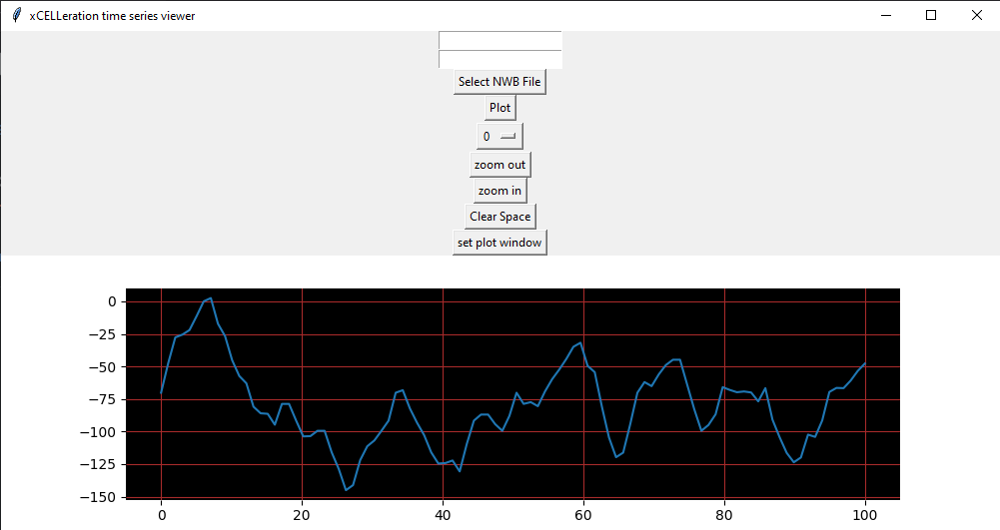

# timeSeries_visualisation

  

current GUI

### Features to implement - Todo list

- [x] display time series for multiple channels
- [x] zoom
- [x] pan across time series
- [x] truncate to range
- [ ] display multiple channels in parallel
- [x] toggle grid lines
- [x] select bakground/plot colour
- [ ] load Open Ephys directory
- [ ] Export to NWB feature
- [ ] Concatanate time series
- [ ] toggle between seconds and samples in the x-axis.

### Optimizations and polishes- Todo list

- [x] button placement ( all square buttons at the top in one row. )
- [ ] add icons to buttons instead of title ( with hover over help feature )
- [ ] fix framerate when zooming and panning.
